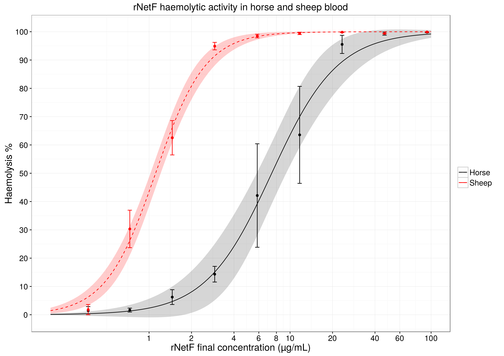
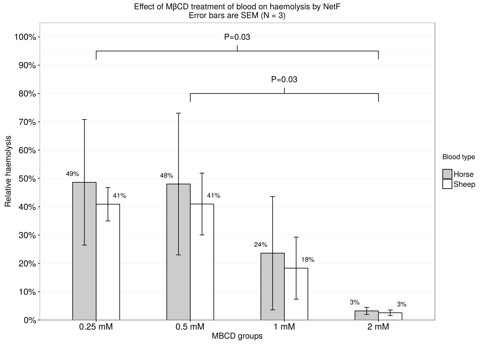

# About this repository
Here you can see some of the `R` code I used in my MRes thesis, along with its output.

There is an example of dose-response curve and a non-parametric analysis of variance.
###Haemolysis analysis:

###MβCD analysis:

